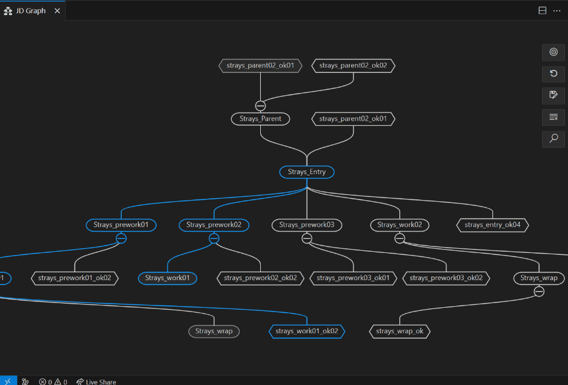
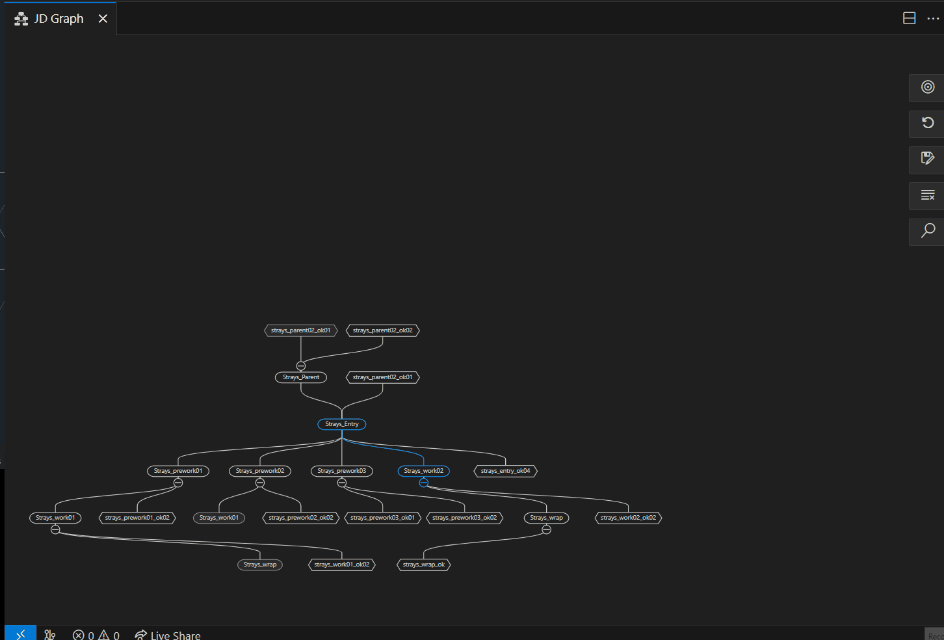
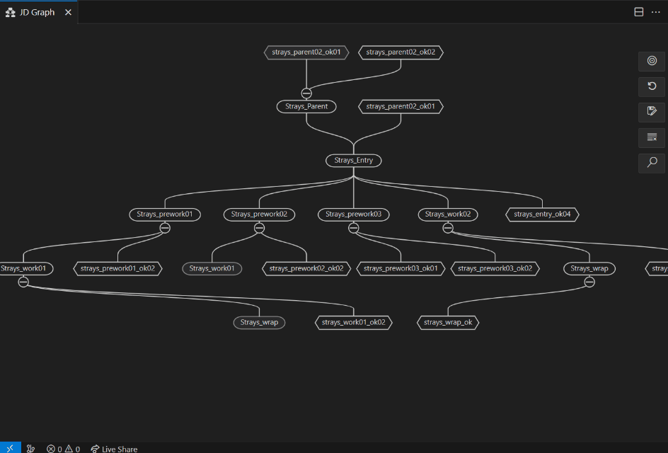
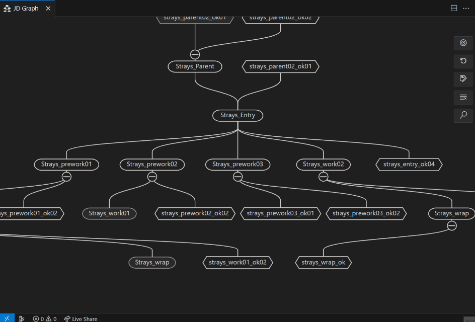
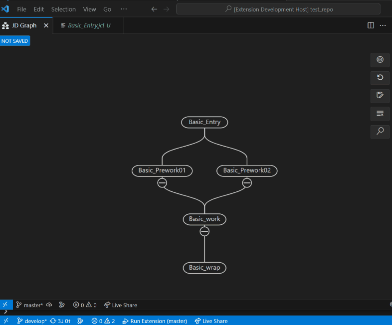
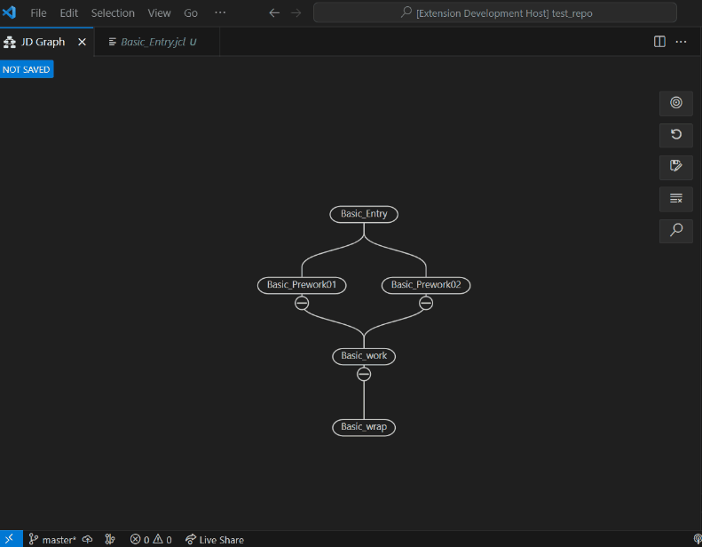
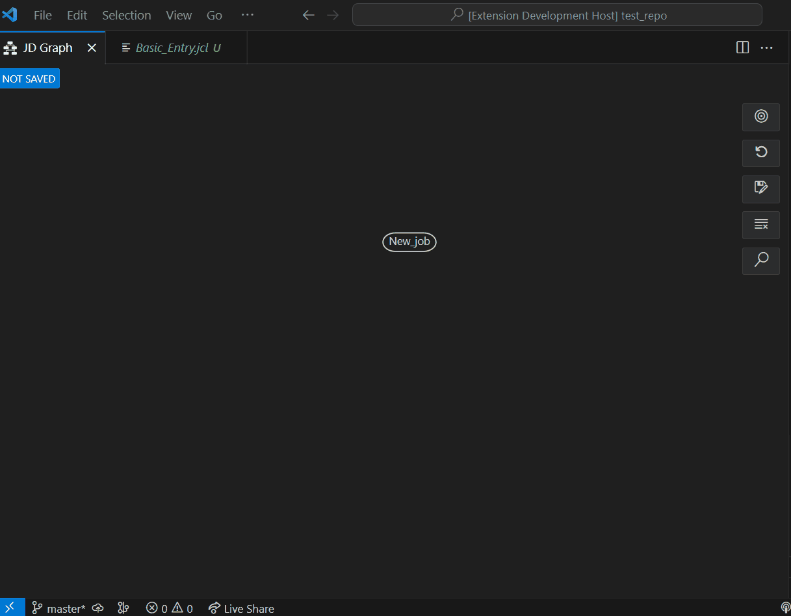

# Canvas Menu

## Table of content
- [Canvas Menu](#canvas-menu)
	- [Table of content](#table-of-content)
	- [Introduction](#introduction)
	- [Use cases](#use-cases)
		- [Export SVG](#export-svg)
		- [Recenter canvas](#recenter-canvas)
		- [Reset zoom](#reset-zoom)
		- [Redraw canvas](#redraw-canvas)
		- [Create connection](#create-connection)
		- [Create job](#create-job)
		- [Delete job](#delete-job)

## Introduction
This context menu is displayed when you do right-click in the canvas.

## Use cases

### Export SVG

1. Click on the "Export SVG" option
2. Enter the desire name for the .svg file

### Recenter canvas

1. Click on the "Recenter Canvas" option

### Reset zoom

1. Click on the "Reset zoom" option

### Redraw canvas

1. Click on the "Redraw canvas" option
### Create connection

Note: By selecting this option, you can define a trigger for a specific node and specify which node will be triggered by another.

1. Click the "Create connection" option
2. Choose or input an existing job that will be triggeree to the next job selected
3. Choose or input an existing job that will be triggered by the previously selected job
4. Input the name for the connection of both jobs, or accept the default name

### Create job

1. Click on the "Create a job" option
### Delete job

1. Click on the "Delete a job" option
