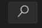

# Floating Menu

## Table of content

- [Floating Menu](#floating-menu)
	- [Table of content](#table-of-content)
	- [Introduction](#introduction)
	- [Use cases](#use-cases)
		- [Center view](#center-view)
		- [Redraw diagram](#redraw-diagram)
		- [Save diagram](#save-diagram)
		- [Clear statuses](#clear-statuses)
		- [Search jobs](#search-jobs)

## Introduction

This section will explain the right-floating vertical menu

## Use cases

### Center view

1. Click on the center view button 
2. The grap will center in the actual scale

### Redraw diagram

1. Click on the redraw diagram  
2. The graph will redraw in the original scale

### Save diagram

1. Click on the save diagram button 
2. Put the desire name for the .svg file

### Clear statuses

Prerequisite:  Highlighted Path

1. Click the clear statuses button 
2. The highlighted paths will be erased

### Search jobs

1. Click on the search button 
2. Select a job or enter the desired job in the command palette.

