# General functionality

## Table of contents
- [General functionality](#general-functinality)
	- [Table of contents](#table-of-contents)
	- [Introduction](#introduction)
	- [Set Up](#previous-settings)
	- [Open a graph](#open-a-graph)
		- [Open a Graph from json](#open-a-graph-from-json)
			- [Open from this](#open-from-this)
			- [Open default](#open-default)
			- [Load graph data](#load-graph-data)
		- [Open a graph from jcl](#open-a-graph-from-jcl)
	- [Movement in the graph](#movement-in-the-graph)
	- [Zoom in/out](#zoom-inout)
	- [Highlight path](#highlight-path)
	- [Hide path](#hide-path)
	- [Show path](#show-path)

## Introduction
In this section, we explain the overall operation of the application.

## Set Up

Before explaining the extension's functionalities, it is necessary to configure a series of parameters for proper operation.

1. **Used Zowe Profile:**
	For all operations related to Zowe, it is necessary to establish the Zowe profile to use.
	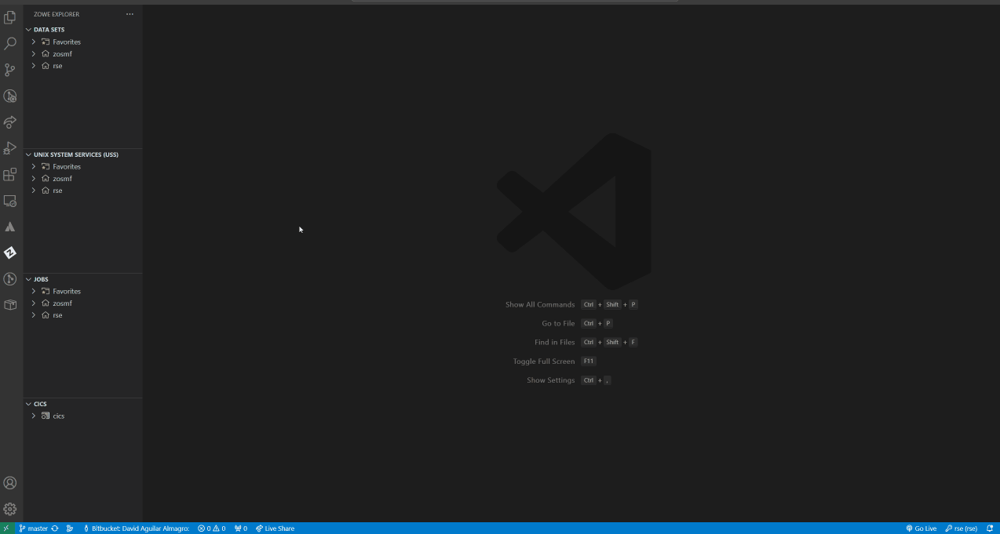
	
	1.1. Go to zowe explorer section.
	1.2. Right click button on the desire profile to select(rse, zosmf)
	1.3. Click on the "Set Scheduler Viewer ZOWE profile"
	**Note:** Can put the profile manually from Settings -> Extensions -> Scheduller Viewer -> Used Zowe Profile and introduce the desired profile.  
	 
2. **Default graph file**
	A default file must be selected for default graph file, are two types:
	1. **Zowe Default File Path**
		It will selected if the Use USS option is checked. It will obtain the file from Unix System Services.
	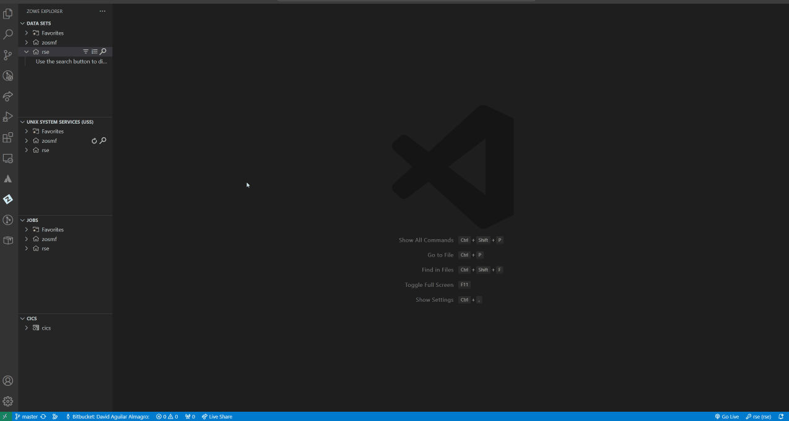
		2.1.1 Go to Settings -> Extensions -> Scheduller Viewer
		2.1.2 Check the Use USS option
		2.1.3. Introduce the path for Zowe Default File Path
	 
	2. **Local Default File Path**
		This path will selected if the Use USS option is not checked.
		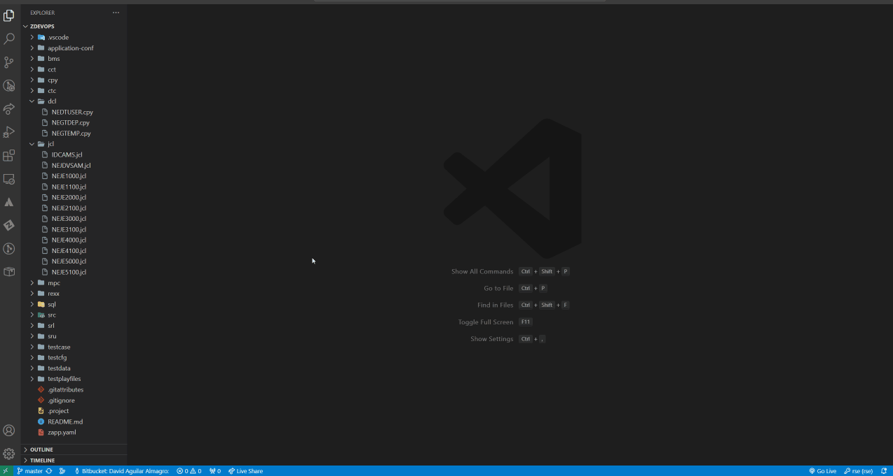
		2.2.1 Go to Settings -> Extensions -> Scheduller Viewer
		2.2.2 Uncheck the Use USS option
		2.2.3 Introduce the path for Local Default File Path
		**Note:** Relative paths are relative to the project.

### Open a Graph
Are two ways to open a Graph, from a .json or .jcl files.

**Note**: Opening a graph will only be possible if a default file path is configured, either for a local file or a Zowe file

#### Open a Graph from json

**Prerequisite**: Having a default path configured.

Note: We have several ways to open or load a file from json.

##### Open from this
**Prerequisite**: Having a .json file opened

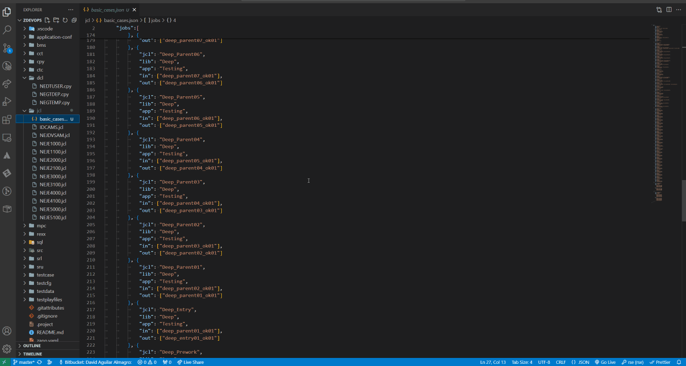

1. With the .json file opened, press Ctrl + shift + p
2. Select "Scheduler Viewer: Open From This" 
##### Open default
**Prerequisite**: A default path configured
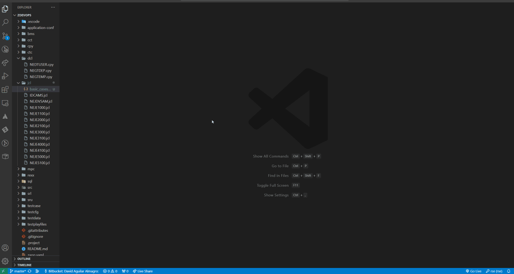

1. With the .json file opened, press Ctrl + shift + p
2. Select "Scheduler Viewer: Open Default"

##### Load Graph data

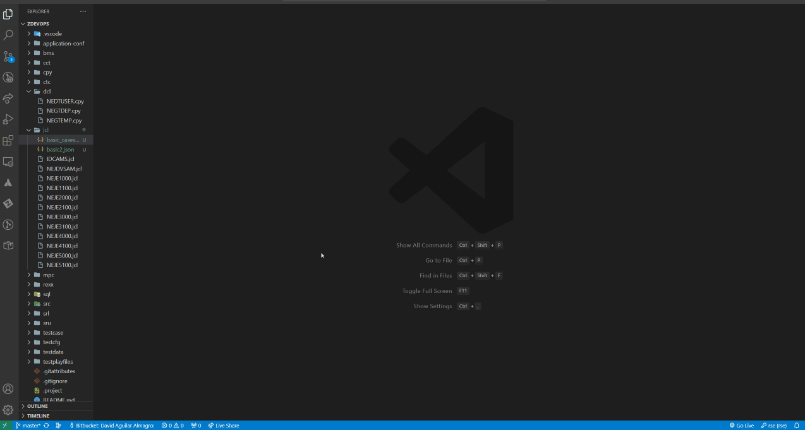

1. Press Ctrl + shift + p
2. Select "Scheduler Viewer: load Graph Data"

#### Open a graph from jcl
**Prerequisite**: Having a default path configured and .jcl file accesible on explorer section.
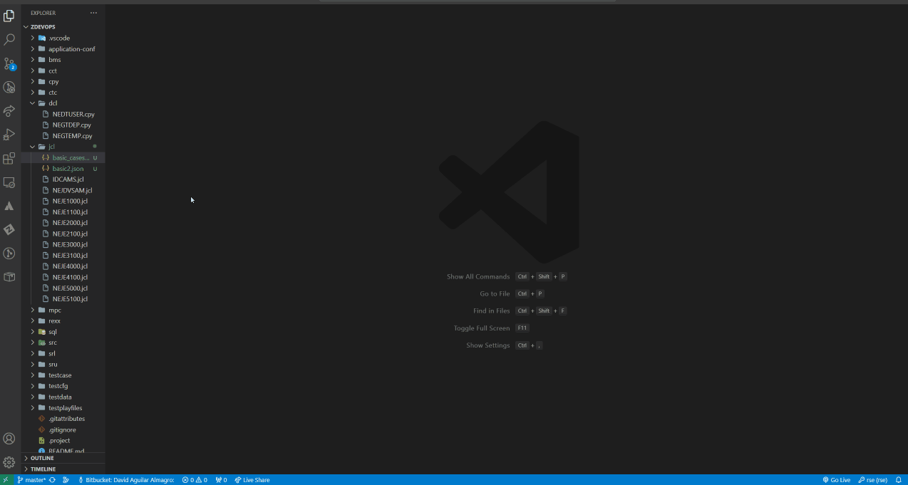
1. Right click bottom on a .jcl file(Explorer section)
2. Select "Open in default graph" option

### Movement in the graph

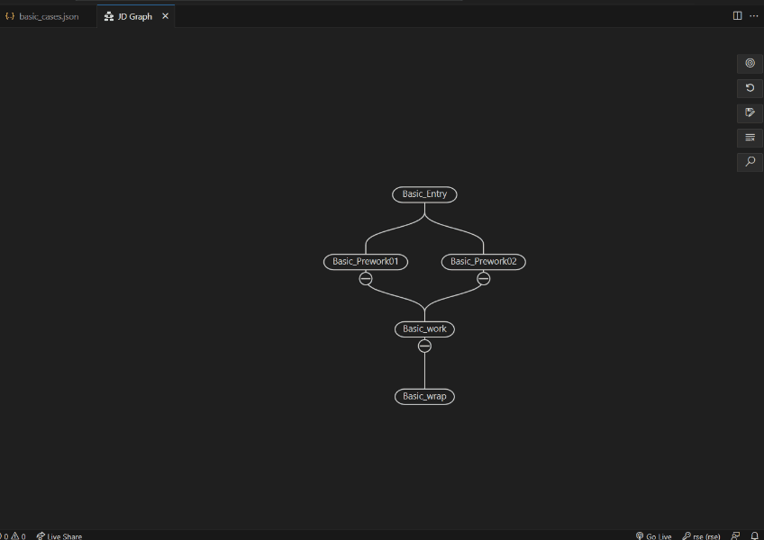

Prerequisite: Having a graph loaded

1. Click and hold the left mouse button, then drag the graph to move it across the canvas.

### Zoom in/out

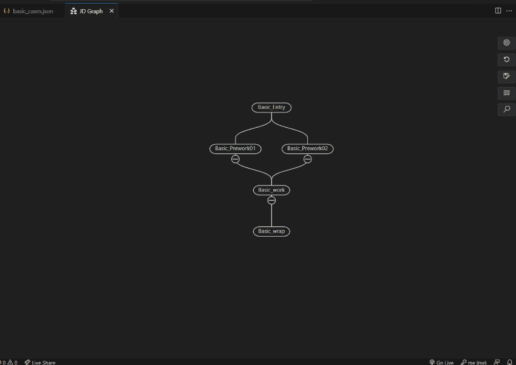

Prerequisite: Having a graph loaded

1. Scroll the mouse wheel to zoom in or out.

### Highlight path

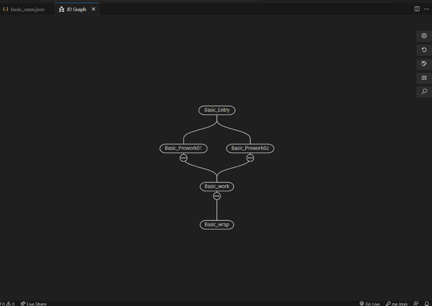

Prerequisite: Having a graph loaded

1. Click in a node.
2. Display the path to the main node.

### Hide path

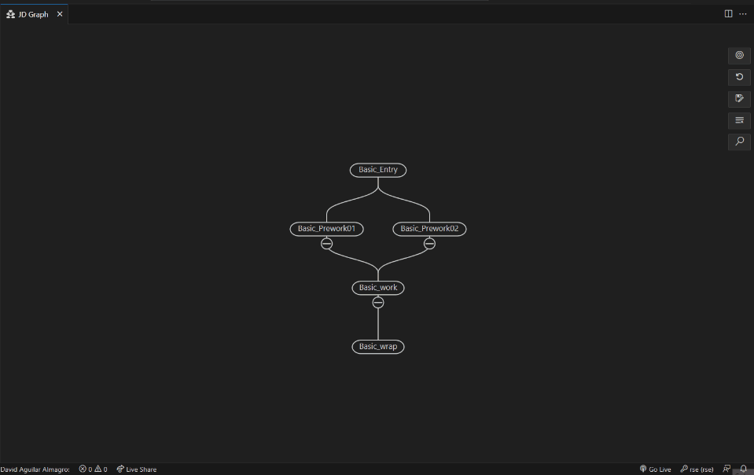

1. Click on minus icon below the node.

### Show path

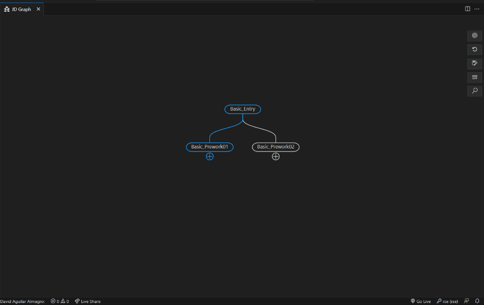

1. Click on plus icon below the node

