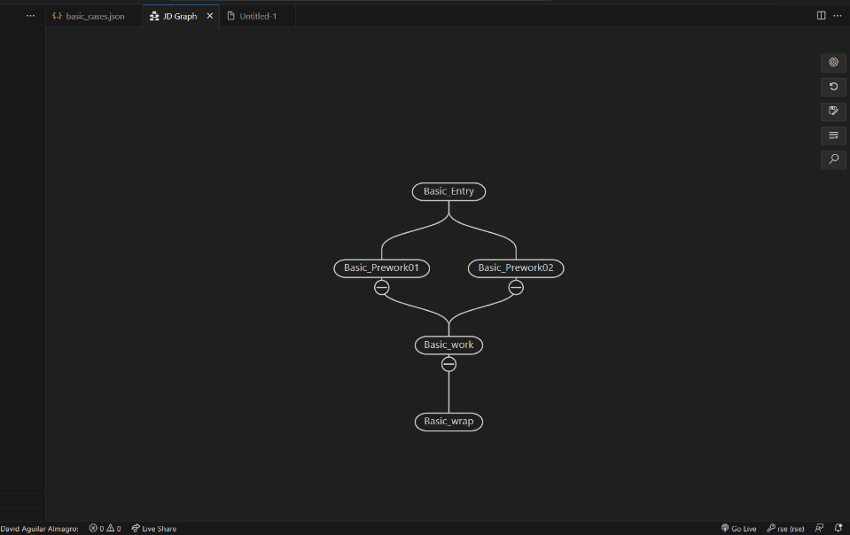

# Job Menu
This job menu is displayed when you right-click on a job node

- [Job Menu](#job-menu)
	- [Copy job name](#copy-job-name)
	- [Copy job id](#copy-job-id)
	- [Describe relations](#describe-relations)
	- [Draw from this](#draw-from-this)
	- [Open file](#open-file)
	- [Open log folder](#open-log-folder)
	- [Run job](#run-job)
	- [Clear this log](#clear-this-log)
	- [Delete job](#delete-job)
	- [Add trigger](#add-trigger)
	- [Add triggeree](#add-triggeree)

Prerequisite: Having a graph loaded

Note: Whenever a modification is made to a node, a "NOT SAVED" message will appear in the top left corner. This message will disappear once the document is saved.
 

## Copy job name

1. Click on the "Copy job name" option
2. The job name will be now available on your clipboard

## Copy job id

1. Click on the "Copy job id(graph-id)" option
2. The job name will be now available on your clipboard

## Describe relations

Note: This pop up menu will be explained in another section

1. Click on the "Describe relations" option
2. The popup menu will open

## Draw from this

1. Click on the "Draw from this" option
2. The graph will be drawn to show the relations of the selected node.

## Open file

Note: This option will only be available if the node has asociated variables

1. Click on the "Open file" option
2. A new file will open, displaying the variables of the selected node

## Open log folder

## Run job

Note: This option will only be available if the node has asociated variables. If we are not connected to the mainframe, a red mark will be displayed over the node to indicate that it won't be executed

1. Click on the "Run job" option
2. The job will be executed on the mainframe

## Clear this log

## Delete job

Note: This action will permanently erase the selected job

1. Click on the "Delete job" option

## Add trigger

Note 1: This option will trigger the selected node
Note 2: if the nodes are already related, a warning message will be displayed

1. Click on the "Add trigger" option on the node that will be triggered
2. Select the node  that will initiate the trigger
3. Enter a name that will establish the relationship between the trigger-launching node and the trigger-listening node.
4. The popup menu for both nodes will display the trigger relationships

## Add triggeree

Note 1: This option will triggeree the selected node
Note 2: if the nodes are already related, a warning message will be displayed

1. Click on the "Add triggeree" option on the node that will be triggered.
2. Select the node  that will listen the triggeree
3. Enter a name that will establish the relationship between the trigger-launching node and the trigger-listening node.
4. The popup menu for both nodes will display the triggeree relationships