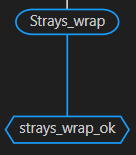

# Mark menu
This menu is displayed when you right-click on a mark node

Note: The mark is represented by the below node of the photo 

- [Mark menu](#mark-menu)
	- [Copy mark name](#copy-mark-name)
	- [Copy mark id](#copy-mark-id)
	- [Describe relations](#describe-relations)

Prerequisite: Having a graph loaded with some mark

## Copy mark name

1. Click on the "Copy mark name" option

## Copy mark id

1. Click on the "Copy mark id" option

## Describe relations

Note: This pop up menu will be explained in another section

1. Click on the "Describe relations" option
2. The popup menu will open