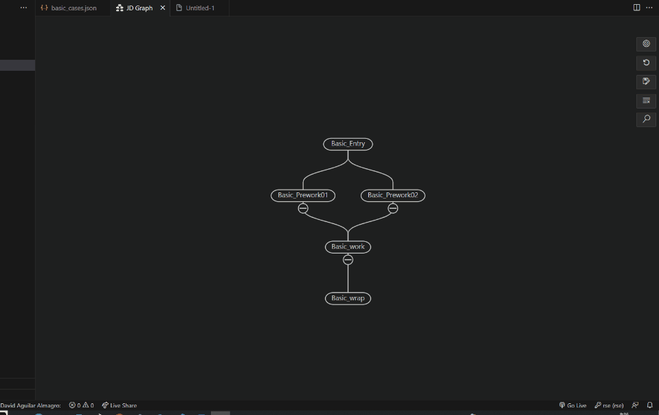
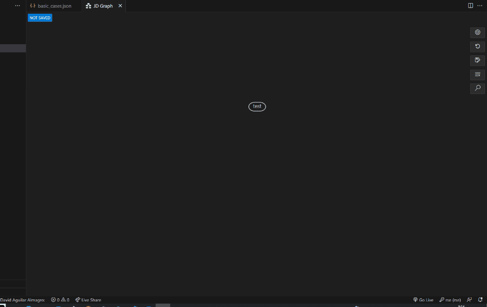
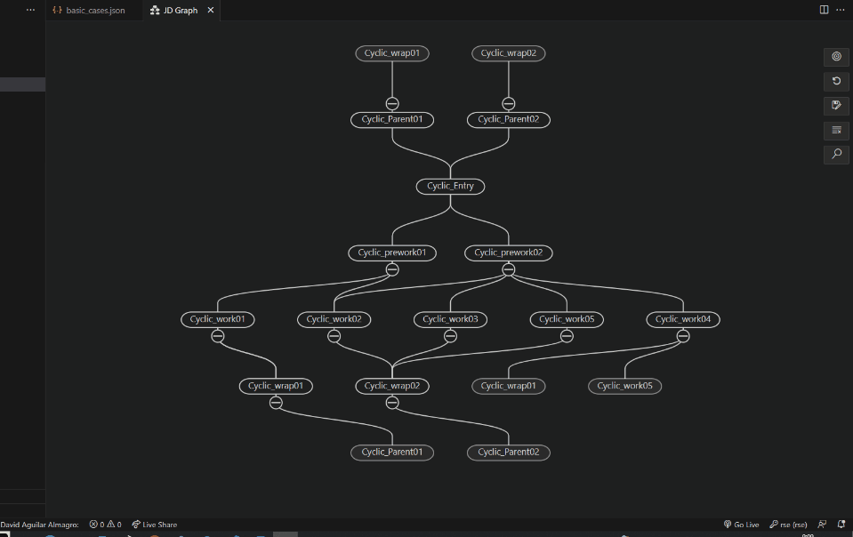
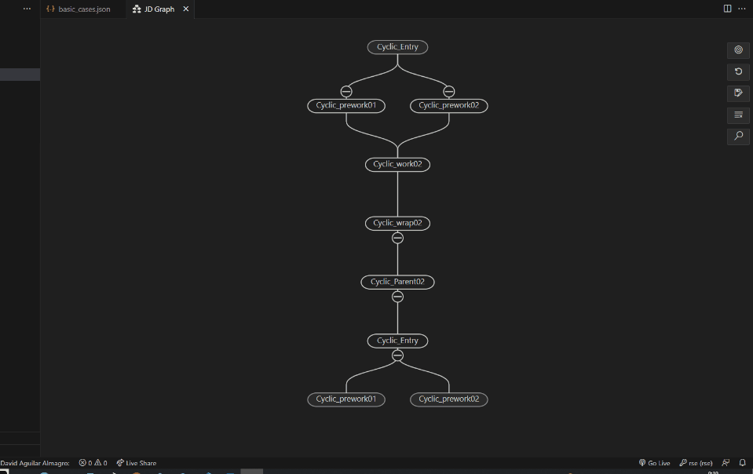
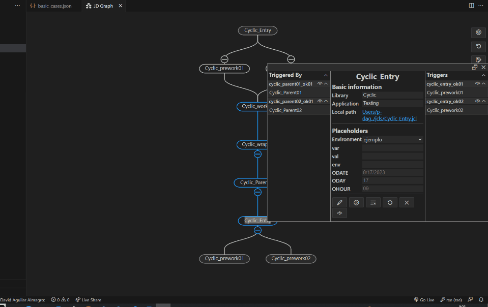
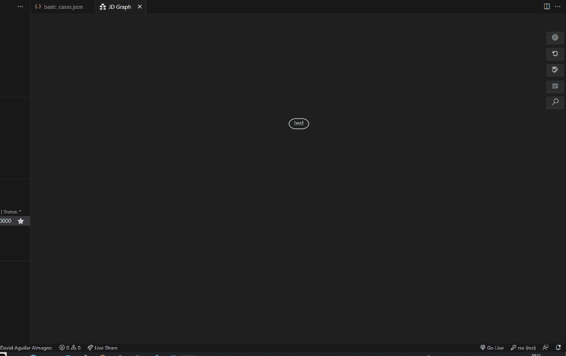
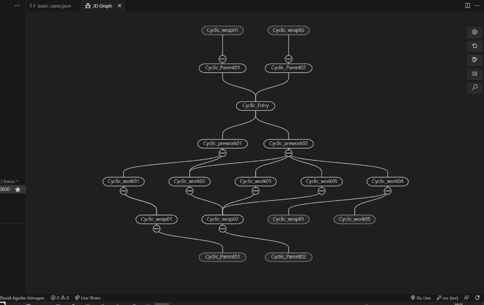
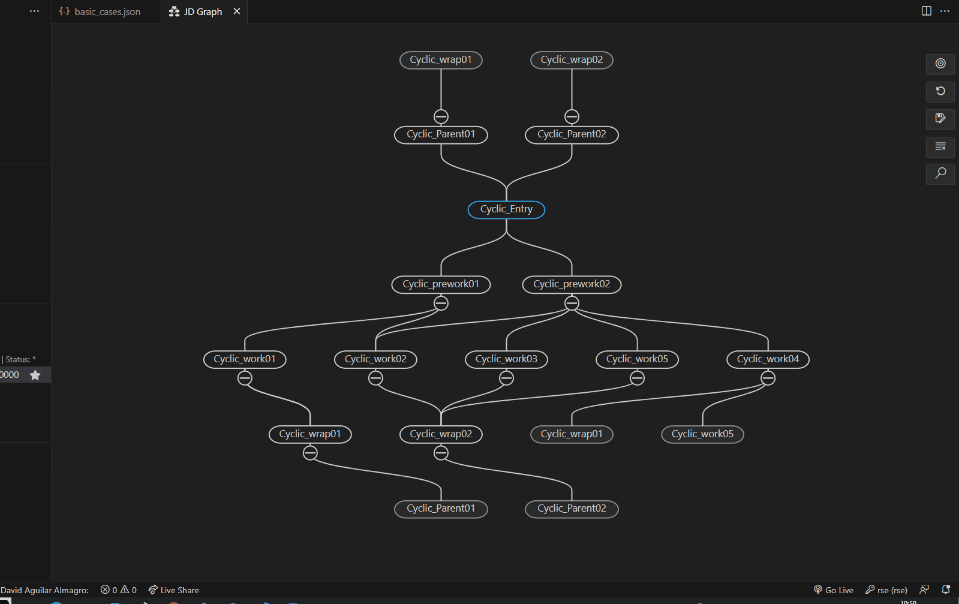
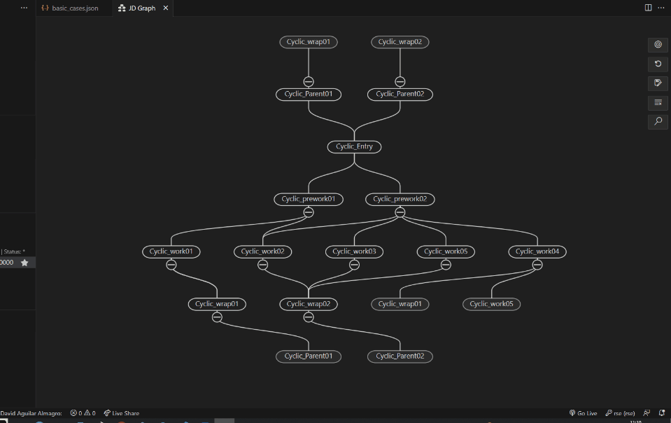
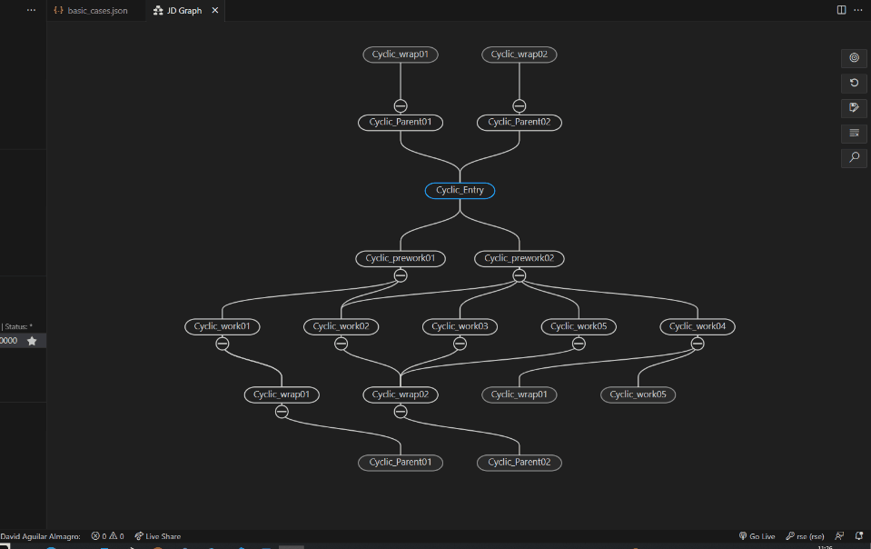

# Popup Menu documentation

## Table of content

- [Popup Menu documentation](#popup-menu-documentation)
	- [Table of content](#table-of-content)
	- [Introduction](#introduction)
	- [Use cases](#use-cases)
		- [Basic information](#basic-information)
		- [Draw from this in graph](#draw-from-this-in-graph)
		- [Execute job](#execute-job)
		- [Clear log](#clear-log)
		- [Refresh placehoders](#refresh-placehoders)
		- [Delete job](#delete-job)
		- [Preview file](#preview-file)
		- [Jobs relations](#jobs-relations)
			- [Triggered by \&\& Triggers](#triggered-by--triggers)
			- [Marks](#marks)
				- [Erase mark from all jobs](#erase-mark-from-all-jobs)
				- [Erase mark from this job](#erase-mark-from-this-job)
				- [Erase mark from all trigger jobs](#erase-mark-from-all-trigger-jobs)
				- [Erase mark from all triggered jobs](#erase-mark-from-all-triggered-jobs)
			- [Jobs](#jobs)
				- [Erase mark from this job](#erase-mark-from-this-job-1)

## Introduction

This menu is displayed when you do double click on a node or click on the "describe relations" option

## Use cases

### Basic information

Notes
1. The fields "library" and "applicaction" are editable
2. The local path will be displayed if a JCL file is associated with the job

### Draw from this in graph

1. Click on the "Draw from this" option
2. The graph will be drawn to show the relations of the selected node.

### Execute job

Note: This option will only be available if the node has asociated variables. If we are not connected to the mainframe, a red mark will be displayed over the node to indicate that it won't be executed

1. Click on the "Execute job" option
2. The job will be executed on the mainframe

### Clear log

Note: Use this option to clear all logs from executed jobs

1. Click on "Clear log" option

### Refresh placehoders

### Delete job

Note: This action will permanently erase the selected job

1. Click the "Delete job" option

### Preview file

Notes
1. This option will be available on the jobs with related variables
2. To view the variables in the preview file, placeholders must be filled

1. Click the "Preview file" option

### Jobs relations

#### Triggered by && Triggers

Notes
1. In this section, you will see the names of trigger actions and their associated jobs

#### Marks

##### Erase mark from all jobs

1. Right-click on the mark's name and choose 'Erase mark from all jobs' from the menu.

##### Erase mark from this job

1. Right-click on the mark's name and choose 'Erase mark from this job' from the menu.

##### Erase mark from all trigger jobs

1. Right-click on the mark's name and choose 'Erase mark from all trigger jobs' from the menu.

##### Erase mark from all triggered jobs

1. Right-click on the mark's name and choose 'Erase mark from all triggered jobs' from the menu.

#### Jobs

##### Erase mark from this job

1. Right-click on the job's name and choose 'Erase mark from this job' from the menu.
